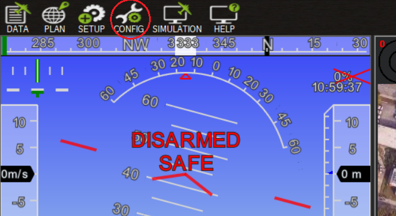
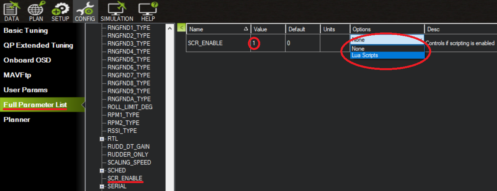
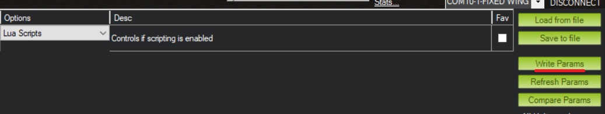
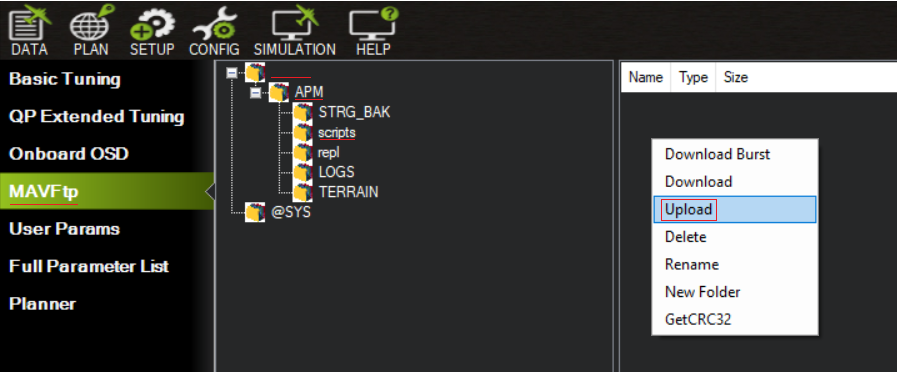
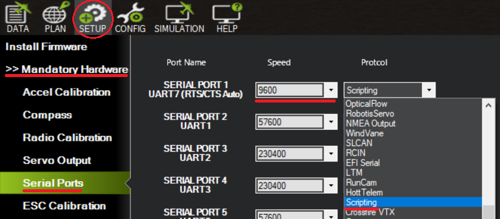

#+title: UAVLAB Serial Samamet (PTH) Setup & Usage Guide
#+author: Justin Tussey
#+date: 2024-08-15
#+options: toc:2
#+EXPORT_EXCLUDE_TAGS: noexport
#  LocalWords:  LocalWords Samamet UAVLAB PTH Lua SCR Config Params uncomment

# #+latex: \tableofcontents

* Table of Contents :toc:noexport:
- [[#setup][Setup]]
  - [[#script-setup][Script Setup]]
  - [[#hardware-setup][Hardware Setup]]
- [[#script-options][Script Options]]
  - [[#report-rate][Report Rate]]
  - [[#multiple-scripting-serial-devices][Multiple Scripting Serial Devices]]
- [[#error-messages-overview][Error Messages Overview]]
  - [[#quick-reference-table][Quick Reference Table]]
  - [[#explanation][Explanation]]

* Setup
** Script Setup
First, connect to the autopilot over USB in Mission Planner. Then go to the
"Config" tab.

#+latex: \begin{center}

#+latex: \end{center}

Once here, go to the "Full Parameter List" menu. Here, find the "=SCR_ENABLE="
parameter. In this parameter, either change the "Value" column from =0= to =1=
or in the "Options" drop-down box, select the "Lua Scripts" option.

Once you have changed the parameter, press the "Write Params" button on the
right side of the screen, to write the newly modified parameters to the
autopilot.

After writing the new parameters, reboot the autopilot so it can fully
initialize the scripting environment.

Once the autopilot has rebooted, and you have reconnected to it in Mission
Planner, return to the "Config" tab. Here go to the "MAVFtp" menu. Then in the
folder structure, navigate to scripts folder from (Unnamed folder) -> "APM" ->
"scripts". Then in scripts, right click in the file display window, then press
the upload button, a file explorer pop-up window will appear. Here, navigate to
the location of the =serial_pth.lua= script. If you do not have the script
downloaded, navigate to
[[https://github.com/ukyuav/sensor-scripts/blob/master/serial/serial_pth.lua]], and
download the script file.

Once you upload the script file, you can move onto the hardware setup.

** Hardware Setup
First, navigate to the "Setup" tab. Here under the "Mandatory Hardware" section,
go to the "Serial Ports" menu. Then navigate to the serial port that the Samamet
is connected to. Refer to the manual for the autopilot for the mapping from the
hardware serial ports, to their names in Mission Planner.

For the port the Samamet is connected to, change the baud rate to =9600=, and
change the protocol to the "Scripting" protocol. Once you have selected these
options, reboot the autopilot for the changes to take effect. Once you have
rebooted, you should now be able to see the Samamet report messages in Mission
Planner.

* Script Options
The script has several options that are configurable. We will be going over two that are needed for normal operation.

** Report Rate
The rate at which the Samamet script send messages of the data it collects,
by default, is two seconds. To change the rate at which these messages are sent,
change the value of the ~REPORT_RATE~ constant, on line =27=.

#+begin_src lua
-- How often we report data to the Mission Planner output
local REPORT_RATE = uint32_t(2000) -- milliseconds
#+end_src

To change the time, change the value inside the parentheses of the ~uint32_t~
function. Note this value is in milliseconds, so to have a report rate of ten
seconds, you will enter =10000= inside of the parentheses.

Once you have made the changes, save the file, and re-upload the script to the
autopilot.

** Multiple Scripting Serial Devices
In the event there are multiple serial devices being accessed by scripts, you
will have to configure one of the scripts to select the second scripting
protocol port it finds, as opposed to the first.

For example, lets say we have a serial anemometer connected to Serial 2, and the
Samamet connected to Serial 4. If you were to leave the script as is, the
Samamet script would connect to Serial 2, since it comes before Serial 4, and
try to decode the data from the anemometer, which will cause errors.

In this situation, since the Samamet is on the lower serial port, you will have
to change the serial port that the script looks for. To change this, got to line
=50=.

#+begin_src lua
-- SERIALx_PROTOCOL 28
local PORT = assert(serial:find_serial(0),"No Scripting Serial Port")
-- local PORT = assert(serial:find_serial(1),"No Scripting Serial Port")
#+end_src

Here comment out the first line with ~serial:find_serial(0)~ by adding two
dashes to the beginning of the line (=--=), and uncomment the line with
~serial:fine_serial(1)~ by removing the two dashes.

Once you have made these changes, save the file and upload it to the autopilot.

If the Samamet is above the other scripting serial port, then you will have to
modify the script of the other serial scripting device.

* Error Messages Overview
** Quick Reference Table

| Mission Planner Output            | Log File         | Error Type                |
|-----------------------------------+------------------+---------------------------|
| ERROR SAMA: Disconnected Sensor   | No data received | Disconnected sensor       |
| ERROR SAMA: Invalid message frame | Invalid frame    | Corrupted/Incomplete data |
| ERROR SAMA: Data failed checksum  | Checksum fail    | Corrupted/Incomplete data |
| ERROR SAMA: Failed to parse data  | Parsing fail     | Corrupted/Incomplete data |

** Explanation
*** Disconnected Sensor

If the script stops receiving data from the Samamet, it will send the following
error to the Mission Planner output.

#+begin_example
6/11/2024 11:02:42 AM : ERROR SAMA: Disconnected Sensor
#+end_example

The error message will also appear in the log file, under the "SAMA" section in
the errors column, with the message "No data received".

A disconnected sensor error can occur when there is an improper connection
between the Samamet and the autopilot. This can also occur if the Tx and Rx pins

*** Corrupted or Incomplete data
If the script receives corrupted data, or an incomplete message, there are
several errors that can appear.

**** Invalid Frame

An invalid frame error is when the script detects that the message it has
received from the serial line does not contain the standard NMEA-0183 sentence
starting or ending characters, being '=$=' and =<CR><LF>= respectively. If the
script detects this, it will send the following error to the Mission Planner
output.

#+begin_example
6/11/2024 11:02:42 AM : ERROR SAMA: Invalid message frame
#+end_example

The error message will also appear in the log file, under the "SAMA" section in
the errors column, with the message "Invalid frame".

An invalid frame error can occur when the data coming into the autopilot has
been corrupted. Likely due to noise on the serial line, or an improper
connection between the Samamet and the autopilot.

An invalid frame can also occur when the script reads the parts of two messages,
and tries to decode it as a single message. This can happen if there are
multiple messages in the serial queue at once. This is usually happens when the
Samamet starts sending data before the script can fully initialize and start
decoding messages, or when the script running to slow and cannot keep up with
the amount of messages that are being sent. The script is designed to handle
when this happens and will clear the queue to ensure it can catch back up or to
're-align' the messages in the queue.

**** Checksum Fail

A checksum fail error is when the script detects that the message has been
corrupted in some manner. It does this by verifying that the checksum that is
sent with the message matches with the checksum the script calculates.

If the checksums do not match, or if there is an issue when extracting the
checksum from the message, the script will send the following message to the
Mission Planner output.

#+begin_example
6/11/2024 11:02:42 AM : ERROR SAMA: Data failed checksum
#+end_example

The error message will also appear in the log file, under the "SAMA" section in
the errors column, with the message "Checksum fail".

An checksum fail error will occur when the data coming into the autopilot has
been corrupted. Likely due to noise on the serial line, or an improper
connection between the Samamet and the autopilot.

**** Parsing Fail

A parsing fail error is when the script cannot properly extract the data from
the message.

If the script is unable to parse the message, it will send the following error
message to the Mission Planner output.

#+begin_example
6/11/2024 11:02:42 AM : ERROR SAMA: Failed to parse data
#+end_example

The error message will also appear in the log file, under the "SAMA" section in
the errors column, with the message "Parsing fail".

While possible, it is unlikely that a parsing error will come from a corrupted
or incomplete message, since the message frame verification and checksum
verification will catch the majority of the corrupted or incomplete messages. It
is more likely that ~parse_data()~ has been edited and there is a bug with
either the regexes or with how the function performs data extraction.
